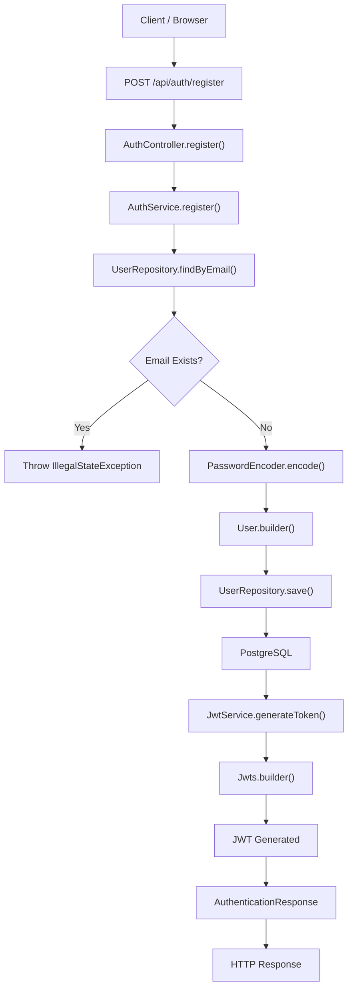
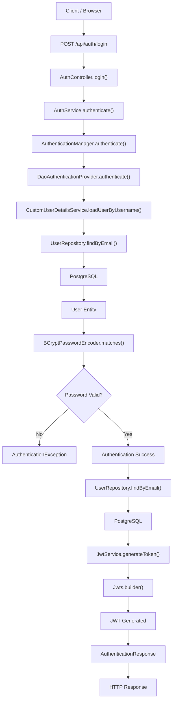
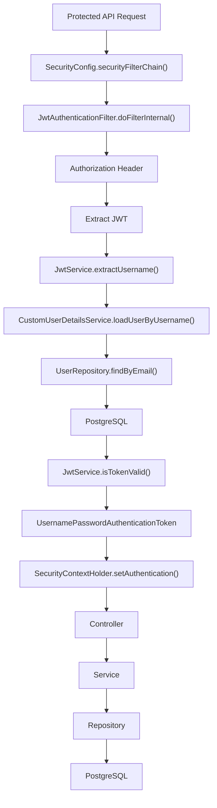

# Authentication APIs

---

# POST /api/auth/register

## Controller Entry Point

```text
Browser / Postman
        |
        v
POST /api/auth/register
        |
        v
AuthController.register(RegisterRequest request)
```

---

## Complete Execution Path

```text
Client
 |
 v
POST /api/auth/register
 |
 v
DispatcherServlet
 |
 v
AuthController.register(RegisterRequest request)
 |
 v
AuthService.register(RegisterRequest request)
 |
 +--------------------------------------------------+
 | userRepository.findByEmail(request.getEmail())   |
 +--------------------------------------------------+
 |
 |---- User Exists?
 |         |
 |         +---- YES
 |         |       |
 |         |       v
 |         |  throw IllegalStateException
 |         |
 |         +---- NO
 |
 v
passwordEncoder.encode(request.getPassword())
 |
 v
User.builder()
    .name(...)
    .email(...)
    .password(...)
    .roles(Set.of(Role.ROLE_USER))
    .build()
 |
 v
userRepository.save(user)
 |
 v
PostgreSQL
 |
 v
JwtService.generateToken(user)
 |
 v
JwtService.generateToken(Map<String,Object>, UserDetails)
 |
 v
Jwts.builder()
 |
 v
JWT Token Generated
 |
 v
AuthenticationResponse.builder()
        .token(jwtToken)
        .build()
 |
 v
AuthController
 |
 v
HTTP 200 Response
 |
 v
Client Receives JWT
```

---

## Mermaid Flowchart



---

# POST /api/auth/login

## Controller Entry Point

```text
Browser / Postman
        |
        v
POST /api/auth/login
        |
        v
AuthController.login(AuthenticationRequest request)
```

---

## Complete Execution Path

```text
Client
 |
 v
POST /api/auth/login
 |
 v
DispatcherServlet
 |
 v
AuthController.login(AuthenticationRequest request)
 |
 v
AuthService.authenticate(AuthenticationRequest request)
 |
 v
AuthenticationManager.authenticate(
    UsernamePasswordAuthenticationToken
)
 |
 v
DaoAuthenticationProvider.authenticate()
 |
 v
CustomUserDetailsService.loadUserByUsername(email)
 |
 v
UserRepository.findByEmail(email)
 |
 v
PostgreSQL
 |
 v
User Entity Returned
 |
 v
BCryptPasswordEncoder.matches()
 |
 |---- Password Valid?
 |         |
 |         +---- NO
 |         |       |
 |         |       v
 |         |  AuthenticationException
 |         |
 |         +---- YES
 |
 v
Authentication Success
 |
 v
UserRepository.findByEmail(email)
 |
 v
PostgreSQL
 |
 v
User Entity Returned
 |
 v
JwtService.generateToken(user)
 |
 v
JwtService.generateToken(Map<String,Object>, UserDetails)
 |
 v
Jwts.builder()
 |
 v
JWT Token Generated
 |
 v
AuthenticationResponse.builder()
        .token(jwtToken)
        .build()
 |
 v
AuthController
 |
 v
HTTP 200 Response
 |
 v
Client Receives JWT
```

---

## Mermaid Flowchart



---

# JWT Authentication Flow After Login

## Complete Execution Path For Any Protected Endpoint

Example:

```http
GET /api/users/me/tickets
Authorization: Bearer eyJ...
```

```text
Client
 |
 v
SecurityConfig.securityFilterChain()
 |
 v
JwtAuthenticationFilter.doFilterInternal()
 |
 v
request.getHeader("Authorization")
 |
 v
Extract JWT
 |
 v
JwtService.extractUsername(jwt)
 |
 v
JwtService.extractAllClaims(jwt)
 |
 v
Jwts.parser()
 |
 v
Email Extracted
 |
 v
CustomUserDetailsService.loadUserByUsername(email)
 |
 v
UserRepository.findByEmail(email)
 |
 v
PostgreSQL
 |
 v
UserDetails
 |
 v
JwtService.isTokenValid(jwt, userDetails)
 |
 v
UsernamePasswordAuthenticationToken
 |
 v
SecurityContextHolder
        .getContext()
        .setAuthentication(...)
 |
 v
Controller Method Executes
 |
 v
Service Method Executes
 |
 v
Repository Method Executes
 |
 v
PostgreSQL
 |
 v
Response Returned
```

---

## Mermaid Flowchart

