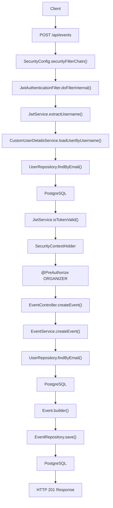
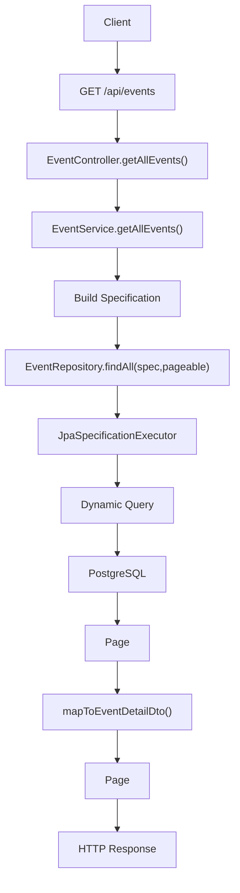
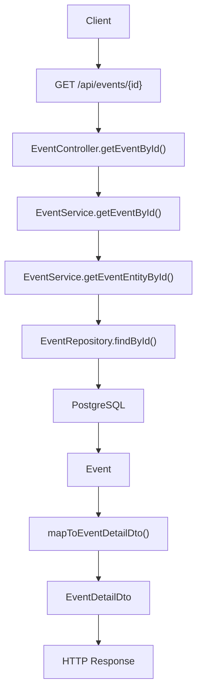
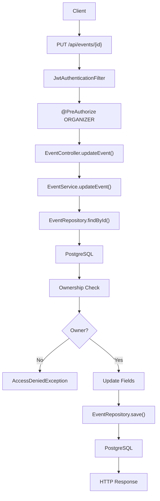
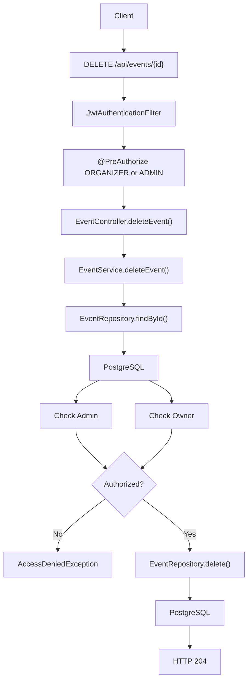
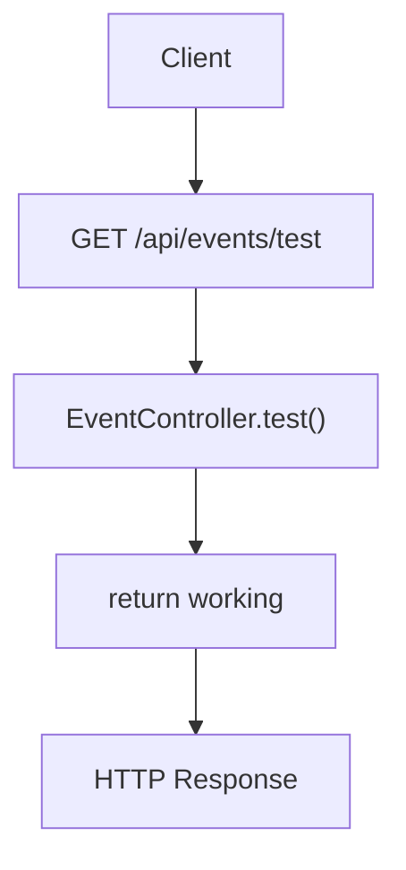

# Event APIs

---

# POST /api/events

## Complete Execution Path

```text
Client / Browser
 |
 v
POST /api/events
 |
 v
SecurityConfig.securityFilterChain()
 |
 v
JwtAuthenticationFilter.doFilterInternal()
 |
 v
JwtService.extractUsername(jwt)
 |
 v
CustomUserDetailsService.loadUserByUsername(email)
 |
 v
UserRepository.findByEmail(email)
 |
 v
PostgreSQL
 |
 v
JwtService.isTokenValid()
 |
 v
SecurityContextHolder.setAuthentication()
 |
 v
@PreAuthorize("hasRole('ORGANIZER')")
 |
 v
EventController.createEvent(CreateEventRequest request)
 |
 v
EventService.createEvent(CreateEventRequest request)
 |
 v
SecurityContextHolder.getContext()
 |
 v
Authentication.getPrincipal()
 |
 v
UserDetails.getUsername()
 |
 v
UserRepository.findByEmail(email)
 |
 v
PostgreSQL
 |
 v
Event.builder()
 |
 v
EventRepository.save(event)
 |
 v
PostgreSQL
 |
 v
Created Event Returned
 |
 v
ServletUriComponentsBuilder.buildAndExpand()
 |
 v
HTTP 201 Created
 |
 v
Response Returned
```

---

## Mermaid Flowchart



---

# GET /api/events

## Complete Execution Path

```text
Client / Browser
 |
 v
GET /api/events
 |
 v
SecurityConfig
 |
 v
Endpoint Public
 |
 v
EventController.getAllEvents(
    Pageable,
    title,
    location,
    date
)
 |
 v
EventService.getAllEvents(
    pageable,
    title,
    location,
    date
)
 |
 v
Specification<Event> spec
 |
 +-----------------------------+
 | Title Filter                |
 +-----------------------------+
 |
 +-----------------------------+
 | Location Filter             |
 +-----------------------------+
 |
 +-----------------------------+
 | Date Filter                 |
 +-----------------------------+
 |
 v
EventRepository.findAll(
    spec,
    pageable
)
 |
 v
JpaSpecificationExecutor
 |
 v
Dynamic SQL Generated
 |
 v
PostgreSQL
 |
 v
Page<Event>
 |
 v
EventService.mapToEventDetailDto()
 |
 v
Page<EventDetailDto>
 |
 v
HTTP 200 Response
```

---

## Mermaid Flowchart



---

# GET /api/events/{id}

## Complete Execution Path

```text
Client / Browser
 |
 v
GET /api/events/{id}
 |
 v
SecurityConfig
 |
 v
Endpoint Public
 |
 v
EventController.getEventById(Long id)
 |
 v
EventService.getEventById(Long eventId)
 |
 v
EventService.getEventEntityById(eventId)
 |
 v
EventRepository.findById(eventId)
 |
 v
PostgreSQL
 |
 v
Event Entity
 |
 v
EventService.mapToEventDetailDto()
 |
 v
EventDetailDto
 |
 v
HTTP 200 Response
```

---

## Mermaid Flowchart



---

# PUT /api/events/{id}

## Complete Execution Path

```text
Client / Browser
 |
 v
PUT /api/events/{id}
 |
 v
SecurityConfig.securityFilterChain()
 |
 v
JwtAuthenticationFilter.doFilterInternal()
 |
 v
JwtService.extractUsername()
 |
 v
CustomUserDetailsService.loadUserByUsername()
 |
 v
UserRepository.findByEmail()
 |
 v
PostgreSQL
 |
 v
SecurityContextHolder.setAuthentication()
 |
 v
@PreAuthorize("hasRole('ORGANIZER')")
 |
 v
EventController.updateEvent()
 |
 v
EventService.updateEvent()
 |
 v
EventService.getEventEntityById()
 |
 v
EventRepository.findById()
 |
 v
PostgreSQL
 |
 v
Load Existing Event
 |
 v
SecurityContextHolder.getAuthentication()
 |
 v
Current User Email
 |
 v
Existing Event Organizer Email
 |
 v
Ownership Validation
 |
 +--------------------+
 | Owner ?            |
 +--------------------+
 |
 |---- NO
 |        |
 |        v
 |  AccessDeniedException
 |
 |---- YES
 |
 v
Update Fields
 |
 v
EventRepository.save()
 |
 v
PostgreSQL
 |
 v
Updated Event Returned
 |
 v
HTTP 200 Response
```

---

## Mermaid Flowchart



---

# DELETE /api/events/{id}

## Complete Execution Path

```text
Client / Browser
 |
 v
DELETE /api/events/{id}
 |
 v
SecurityConfig.securityFilterChain()
 |
 v
JwtAuthenticationFilter.doFilterInternal()
 |
 v
JwtService.extractUsername()
 |
 v
CustomUserDetailsService.loadUserByUsername()
 |
 v
UserRepository.findByEmail()
 |
 v
PostgreSQL
 |
 v
SecurityContextHolder.setAuthentication()
 |
 v
@PreAuthorize("hasAnyRole('ORGANIZER','ADMIN')")
 |
 v
EventController.deleteEvent(Long id)
 |
 v
EventService.deleteEvent(Long eventId)
 |
 v
EventService.getEventEntityById()
 |
 v
EventRepository.findById()
 |
 v
PostgreSQL
 |
 v
Authentication authentication =
 SecurityContextHolder.getContext()
                      .getAuthentication()
 |
 v
Check ROLE_ADMIN
 |
 v
Check Event Owner
 |
 v
Authorization Decision
 |
 +-------------------------+
 | Admin OR Owner ?        |
 +-------------------------+
 |
 |---- NO
 |        |
 |        v
 |  AccessDeniedException
 |
 |---- YES
 |
 v
EventRepository.delete(event)
 |
 v
PostgreSQL
 |
 v
HTTP 204 No Content
```

---

## Mermaid Flowchart



---

# GET /api/events/test

## Complete Execution Path

```text
Client / Browser
 |
 v
GET /api/events/test
 |
 v
SecurityConfig
 |
 v
Public Endpoint
 |
 v
EventController.test()
 |
 v
return "working"
 |
 v
HTTP 200 Response
```

---

## Mermaid Flowchart

