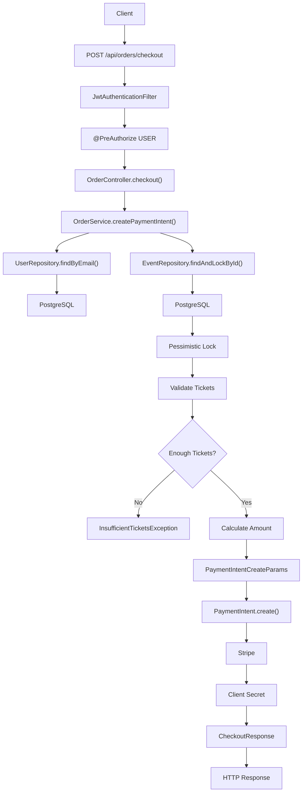
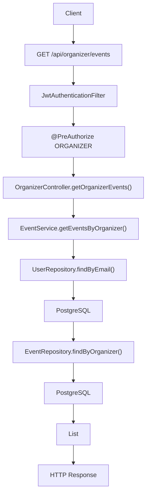
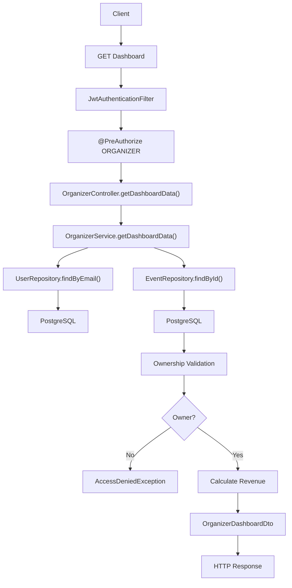
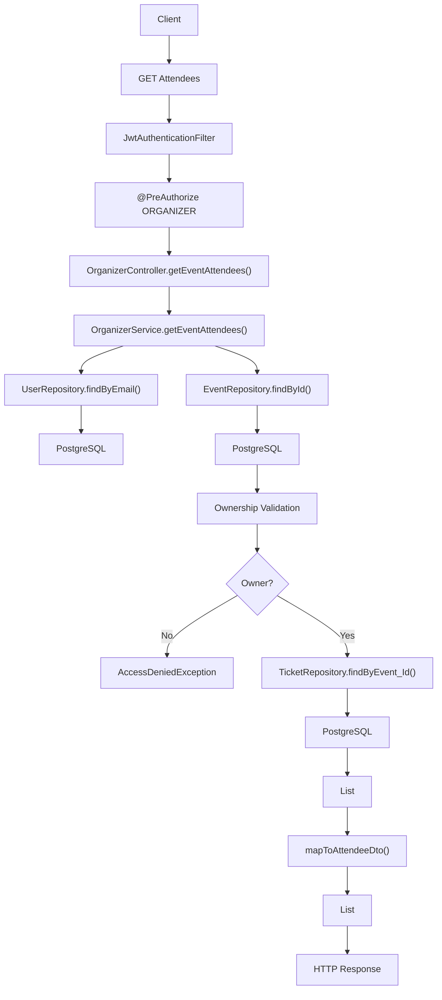

# Order & Organizer APIs

---

# POST /api/orders/checkout

## Complete Execution Path

```text
Client / Browser
 |
 v
POST /api/orders/checkout
 |
 v
SecurityConfig.securityFilterChain()
 |
 v
JwtAuthenticationFilter.doFilterInternal()
 |
 v
JwtService.extractUsername(jwt)
 |
 v
CustomUserDetailsService.loadUserByUsername(email)
 |
 v
UserRepository.findByEmail(email)
 |
 v
PostgreSQL
 |
 v
JwtService.isTokenValid()
 |
 v
SecurityContextHolder.setAuthentication()
 |
 v
@PreAuthorize("hasRole('USER')")
 |
 v
OrderController.checkout(
    CheckoutRequest request
 )
 |
 v
OrderService.createPaymentIntent(
    CheckoutRequest request
 )
 |
 v
SecurityContextHolder.getContext()
 |
 v
Authentication.getName()
 |
 v
UserRepository.findByEmail(email)
 |
 v
PostgreSQL
 |
 v
EventRepository.findAndLockById(
    request.getEventId()
 )
 |
 v
PostgreSQL
 |
 v
PESSIMISTIC_WRITE LOCK ACQUIRED
 |
 v
Calculate Tickets Available
 |
 v
Validate Requested Quantity
 |
 +-----------------------------+
 | Enough Tickets Available ?  |
 +-----------------------------+
 |
 |---- NO
 |        |
 |        v
 |  InsufficientTicketsException
 |
 |---- YES
 |
 v
Calculate Total Amount
 |
 v
Convert Amount To Cents
 |
 v
PaymentIntentCreateParams.builder()
 |
 v
Add Metadata
    userId
    eventId
    ticketQuantity
 |
 v
PaymentIntent.create(params)
 |
 v
Stripe API
 |
 v
PaymentIntent Returned
 |
 v
paymentIntent.getClientSecret()
 |
 v
CheckoutResponse(clientSecret)
 |
 v
HTTP 200 Response
 |
 v
Client Receives Stripe Client Secret
```

---

## Mermaid Flowchart



---

# GET /api/organizer/events

## Complete Execution Path

```text
Client / Browser
 |
 v
GET /api/organizer/events
 |
 v
SecurityConfig.securityFilterChain()
 |
 v
JwtAuthenticationFilter.doFilterInternal()
 |
 v
JwtService.extractUsername()
 |
 v
CustomUserDetailsService.loadUserByUsername()
 |
 v
UserRepository.findByEmail()
 |
 v
PostgreSQL
 |
 v
SecurityContextHolder.setAuthentication()
 |
 v
@PreAuthorize("hasRole('ORGANIZER')")
 |
 v
OrganizerController.getOrganizerEvents()
 |
 v
EventService.getEventsByOrganizer()
 |
 v
SecurityContextHolder.getAuthentication()
 |
 v
Authentication.getName()
 |
 v
UserRepository.findByEmail()
 |
 v
PostgreSQL
 |
 v
Organizer User Entity
 |
 v
EventRepository.findByOrganizer(
    organizer
 )
 |
 v
PostgreSQL
 |
 v
List<Event>
 |
 v
HTTP 200 Response
```

---

## Mermaid Flowchart



---

# GET /api/organizer/dashboard/{eventId}

## Complete Execution Path

```text
Client / Browser
 |
 v
GET /api/organizer/dashboard/{eventId}
 |
 v
SecurityConfig.securityFilterChain()
 |
 v
JwtAuthenticationFilter.doFilterInternal()
 |
 v
JwtService.extractUsername()
 |
 v
CustomUserDetailsService.loadUserByUsername()
 |
 v
UserRepository.findByEmail()
 |
 v
PostgreSQL
 |
 v
SecurityContextHolder.setAuthentication()
 |
 v
@PreAuthorize("hasRole('ORGANIZER')")
 |
 v
OrganizerController.getDashboardData(eventId)
 |
 v
OrganizerService.getDashboardData(eventId)
 |
 v
SecurityContextHolder.getAuthentication()
 |
 v
Authentication.getName()
 |
 v
UserRepository.findByEmail()
 |
 v
PostgreSQL
 |
 v
Organizer Entity
 |
 v
EventRepository.findById(eventId)
 |
 v
PostgreSQL
 |
 v
Event Entity
 |
 v
Validate Event Ownership
 |
 +---------------------+
 | Organizer Owns Event|
 +---------------------+
 |
 |---- NO
 |        |
 |        v
 |  AccessDeniedException
 |
 |---- YES
 |
 v
Calculate Revenue
 |
 v
Build OrganizerDashboardDto
 |
 v
HTTP 200 Response
```

---

## Mermaid Flowchart



---

# GET /api/organizer/events/{eventId}/attendees

## Complete Execution Path

```text
Client / Browser
 |
 v
GET /api/organizer/events/{eventId}/attendees
 |
 v
SecurityConfig.securityFilterChain()
 |
 v
JwtAuthenticationFilter.doFilterInternal()
 |
 v
JwtService.extractUsername()
 |
 v
CustomUserDetailsService.loadUserByUsername()
 |
 v
UserRepository.findByEmail()
 |
 v
PostgreSQL
 |
 v
SecurityContextHolder.setAuthentication()
 |
 v
@PreAuthorize("hasRole('ORGANIZER')")
 |
 v
OrganizerController.getEventAttendees(eventId)
 |
 v
OrganizerService.getEventAttendees(eventId)
 |
 v
SecurityContextHolder.getAuthentication()
 |
 v
Authentication.getName()
 |
 v
UserRepository.findByEmail()
 |
 v
PostgreSQL
 |
 v
Organizer Entity
 |
 v
EventRepository.findById(eventId)
 |
 v
PostgreSQL
 |
 v
Event Entity
 |
 v
Validate Ownership
 |
 +----------------------+
 | Organizer Owns Event |
 +----------------------+
 |
 |---- NO
 |        |
 |        v
 |  AccessDeniedException
 |
 |---- YES
 |
 v
TicketRepository.findByEvent_Id(eventId)
 |
 v
PostgreSQL
 |
 v
List<Ticket>
 |
 v
mapToAttendeeDto(ticket)
 |
 v
AttendeeDto List
 |
 v
HTTP 200 Response
```

---

## Mermaid Flowchart

