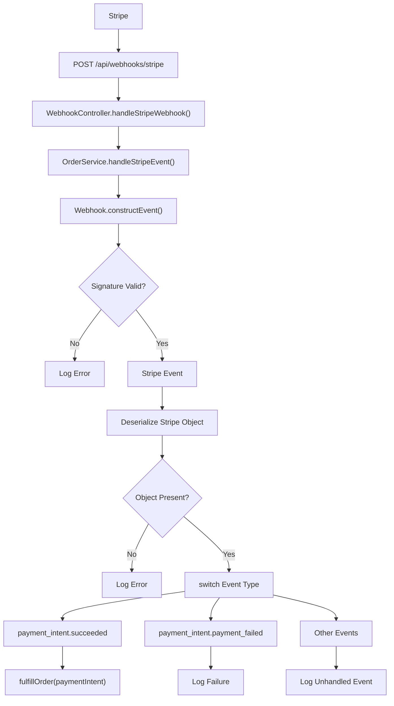
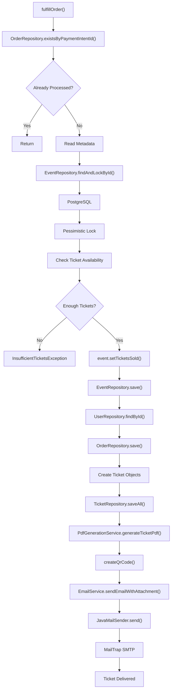

# Stripe Webhook API

---

# POST /api/webhooks/stripe

## Complete Execution Path

```text
Stripe Platform
 |
 v
POST /api/webhooks/stripe
 |
 v
SecurityConfig
 |
 v
Endpoint Marked Public
 |
 v
WebhookController.handleStripeWebhook(
    String payload,
    String sigHeader
 )
 |
 v
OrderService.handleStripeEvent(
    payload,
    sigHeader
 )
 |
 v
Webhook.constructEvent(
    payload,
    sigHeader,
    webhookSecret
 )
 |
 +-----------------------------------+
 | Signature Verification Successful |
 +-----------------------------------+
 |
 |---- NO
 |        |
 |        v
 |  SignatureVerificationException
 |        |
 |        v
 |  Log Error
 |        |
 |        v
 |  Return
 |
 |---- YES
 |
 v
Stripe Event Created
 |
 v
stripeEvent.getDataObjectDeserializer()
 |
 v
getObject()
 |
 +---------------------+
 | Stripe Object Empty |
 +---------------------+
 |
 |---- YES
 |        |
 |        v
 |  Log Error
 |        |
 |        v
 |  Return
 |
 |---- NO
 |
 v
switch(stripeEvent.getType())
 |
 +----------------------------------------------------+
 | payment_intent.succeeded                           |
 +----------------------------------------------------+
 |
 v
PaymentIntent paymentIntent =
(PaymentIntent) stripeObject.get()
 |
 v
OrderService.fulfillOrder(
    paymentIntent
 )
 |
 +----------------------------------------------------+
 | payment_intent.payment_failed                      |
 +----------------------------------------------------+
 |
 v
PaymentIntent failedPaymentIntent
 |
 v
Log Failure Reason
 |
 v
Return
 |
 +----------------------------------------------------+
 | Other Event Types                                  |
 +----------------------------------------------------+
 |
 v
Log Unhandled Event
 |
 v
Return
```

---

## Mermaid Flowchart



---

# Internal Execution Path

## OrderService.fulfillOrder(PaymentIntent paymentIntent)

```text
OrderService.fulfillOrder(
    paymentIntent
)
 |
 v
OrderRepository.existsByPaymentIntentId(
    paymentIntent.getId()
 )
 |
 +----------------------+
 | Already Processed ?  |
 +----------------------+
 |
 |---- YES
 |        |
 |        v
 |  Log Warning
 |        |
 |        v
 |  Return
 |
 |---- NO
 |
 v
paymentIntent.getMetadata()
 |
 v
Extract:
    userId
    eventId
    ticketQuantity
 |
 v
EventRepository.findAndLockById(
    eventId
 )
 |
 v
PostgreSQL
 |
 v
PESSIMISTIC_WRITE LOCK
 |
 v
Calculate Available Tickets
 |
 +------------------------+
 | Enough Tickets Left ?  |
 +------------------------+
 |
 |---- NO
 |        |
 |        v
 |  InsufficientTicketsException
 |
 |---- YES
 |
 v
event.setTicketsSold(
    current + quantity
 )
 |
 v
EventRepository.save(event)
 |
 v
PostgreSQL
 |
 v
UserRepository.findById(userId)
 |
 v
PostgreSQL
 |
 v
User Entity
 |
 v
Order.builder()
 |
 v
OrderRepository.save(order)
 |
 v
PostgreSQL
 |
 v
Order Saved
 |
 v
Loop ticketQuantity times
 |
 v
Ticket.builder()
 |
 v
TicketRepository.saveAll(tickets)
 |
 v
PostgreSQL
 |
 v
Tickets Persisted
 |
 v
pdfGenerationService.generateTicketPdf(
    firstTicket
 )
 |
 v
PdfGenerationService.generateTicketPdf()
 |
 v
createQrCode()
 |
 v
QRCodeWriter.encode()
 |
 v
PDF Generated
 |
 v
emailService.sendEmailWithAttachment()
 |
 v
EmailService.sendEmailWithAttachment()
 |
 v
JavaMailSender.send()
 |
 v
MailTrap SMTP
 |
 v
Ticket Delivered
```

---

## Mermaid Flowchart

