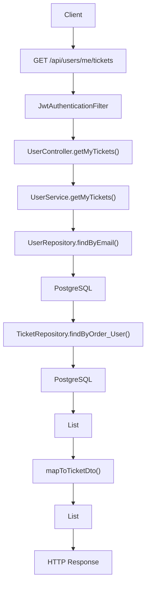
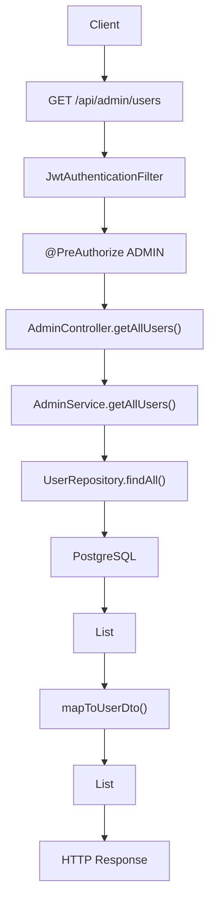
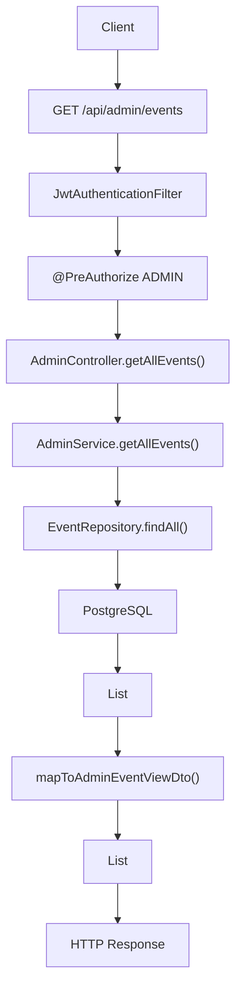
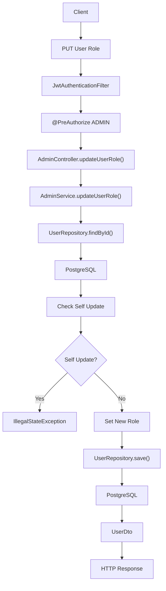
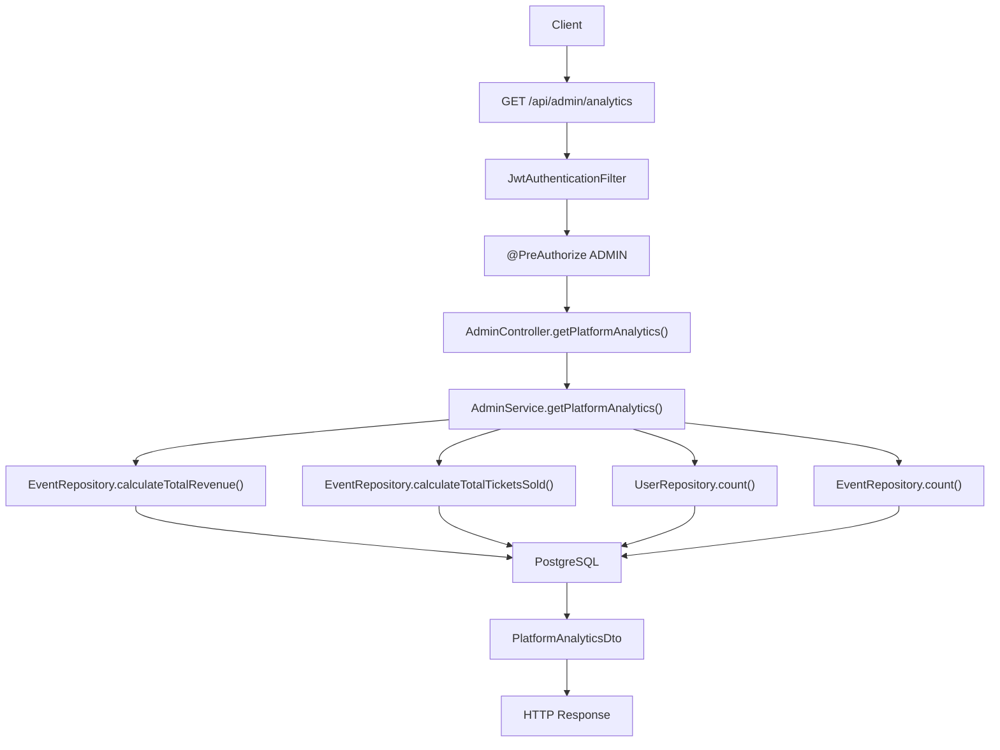

# User & Admin APIs

---

# GET /api/users/me/tickets

## Complete Execution Path

```text
Client / Browser
 |
 v
GET /api/users/me/tickets
 |
 v
SecurityConfig.securityFilterChain()
 |
 v
JwtAuthenticationFilter.doFilterInternal()
 |
 v
JwtService.extractUsername(jwt)
 |
 v
CustomUserDetailsService.loadUserByUsername(email)
 |
 v
UserRepository.findByEmail(email)
 |
 v
PostgreSQL
 |
 v
JwtService.isTokenValid()
 |
 v
SecurityContextHolder.setAuthentication()
 |
 v
UserController.getMyTickets()
 |
 v
UserService.getMyTickets()
 |
 v
SecurityContextHolder.getContext()
 |
 v
Authentication.getName()
 |
 v
UserRepository.findByEmail(email)
 |
 v
PostgreSQL
 |
 v
User Entity
 |
 v
TicketRepository.findByOrder_User(user)
 |
 v
PostgreSQL
 |
 v
List<Ticket>
 |
 v
mapToTicketDto(ticket)
 |
 v
EventSummaryDto.builder()
 |
 v
TicketDto.builder()
 |
 v
List<TicketDto>
 |
 v
HTTP 200 Response
```

---

## Mermaid Flowchart



---

# GET /api/admin/users

## Complete Execution Path

```text
Client / Browser
 |
 v
GET /api/admin/users
 |
 v
SecurityConfig.securityFilterChain()
 |
 v
JwtAuthenticationFilter.doFilterInternal()
 |
 v
JwtService.extractUsername()
 |
 v
CustomUserDetailsService.loadUserByUsername()
 |
 v
UserRepository.findByEmail()
 |
 v
PostgreSQL
 |
 v
SecurityContextHolder.setAuthentication()
 |
 v
@PreAuthorize("hasRole('ADMIN')")
 |
 v
AdminController.getAllUsers()
 |
 v
AdminService.getAllUsers()
 |
 v
UserRepository.findAll()
 |
 v
PostgreSQL
 |
 v
List<User>
 |
 v
mapToUserDto(user)
 |
 v
List<UserDto>
 |
 v
HTTP 200 Response
```

---

## Mermaid Flowchart



---

# GET /api/admin/events

## Complete Execution Path

```text
Client / Browser
 |
 v
GET /api/admin/events
 |
 v
SecurityConfig.securityFilterChain()
 |
 v
JwtAuthenticationFilter.doFilterInternal()
 |
 v
JwtService.extractUsername()
 |
 v
CustomUserDetailsService.loadUserByUsername()
 |
 v
UserRepository.findByEmail()
 |
 v
PostgreSQL
 |
 v
SecurityContextHolder.setAuthentication()
 |
 v
@PreAuthorize("hasRole('ADMIN')")
 |
 v
AdminController.getAllEvents()
 |
 v
AdminService.getAllEvents()
 |
 v
EventRepository.findAll()
 |
 v
PostgreSQL
 |
 v
List<Event>
 |
 v
mapToAdminEventViewDto(event)
 |
 v
List<AdminEventViewDto>
 |
 v
HTTP 200 Response
```

---

## Mermaid Flowchart



---

# PUT /api/admin/users/{userId}/role

## Complete Execution Path

```text
Client / Browser
 |
 v
PUT /api/admin/users/{userId}/role
 |
 v
SecurityConfig.securityFilterChain()
 |
 v
JwtAuthenticationFilter.doFilterInternal()
 |
 v
JwtService.extractUsername()
 |
 v
CustomUserDetailsService.loadUserByUsername()
 |
 v
UserRepository.findByEmail()
 |
 v
PostgreSQL
 |
 v
SecurityContextHolder.setAuthentication()
 |
 v
@PreAuthorize("hasRole('ADMIN')")
 |
 v
AdminController.updateUserRole(
    userId,
    UpdateUserRoleDto
 )
 |
 v
AdminService.updateUserRole(
    userId,
    newRole
 )
 |
 v
UserRepository.findById(userId)
 |
 v
PostgreSQL
 |
 v
Target User Loaded
 |
 v
SecurityContextHolder.getAuthentication()
 |
 v
Current Admin Email
 |
 v
Compare Target User Email
 |
 +-----------------------------+
 | Self Role Change Attempt ?  |
 +-----------------------------+
 |
 |---- YES
 |        |
 |        v
 |  IllegalStateException
 |
 |---- NO
 |
 v
user.setRoles(Set.of(newRole))
 |
 v
UserRepository.save(user)
 |
 v
PostgreSQL
 |
 v
mapToUserDto()
 |
 v
UserDto
 |
 v
HTTP 200 Response
```

---

## Mermaid Flowchart



---

# GET /api/admin/analytics

## Complete Execution Path

```text
Client / Browser
 |
 v
GET /api/admin/analytics
 |
 v
SecurityConfig.securityFilterChain()
 |
 v
JwtAuthenticationFilter.doFilterInternal()
 |
 v
JwtService.extractUsername()
 |
 v
CustomUserDetailsService.loadUserByUsername()
 |
 v
UserRepository.findByEmail()
 |
 v
PostgreSQL
 |
 v
SecurityContextHolder.setAuthentication()
 |
 v
@PreAuthorize("hasRole('ADMIN')")
 |
 v
AdminController.getPlatformAnalytics()
 |
 v
AdminService.getPlatformAnalytics()
 |
 v
EventRepository.calculateTotalRevenue()
 |
 v
PostgreSQL
 |
 v
Revenue Result
 |
 v
EventRepository.calculateTotalTicketsSold()
 |
 v
PostgreSQL
 |
 v
Tickets Sold Result
 |
 v
UserRepository.count()
 |
 v
PostgreSQL
 |
 v
Total Users
 |
 v
EventRepository.count()
 |
 v
PostgreSQL
 |
 v
Total Events
 |
 v
PlatformAnalyticsDto.builder()
 |
 v
PlatformAnalyticsDto
 |
 v
HTTP 200 Response
```

---

## Mermaid Flowchart

