# Event Ticketing System - Architecture & API Flow

## High Level Architecture

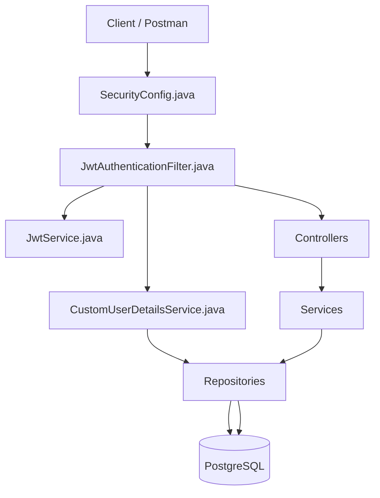

---

# Authentication Flow

## User Registration

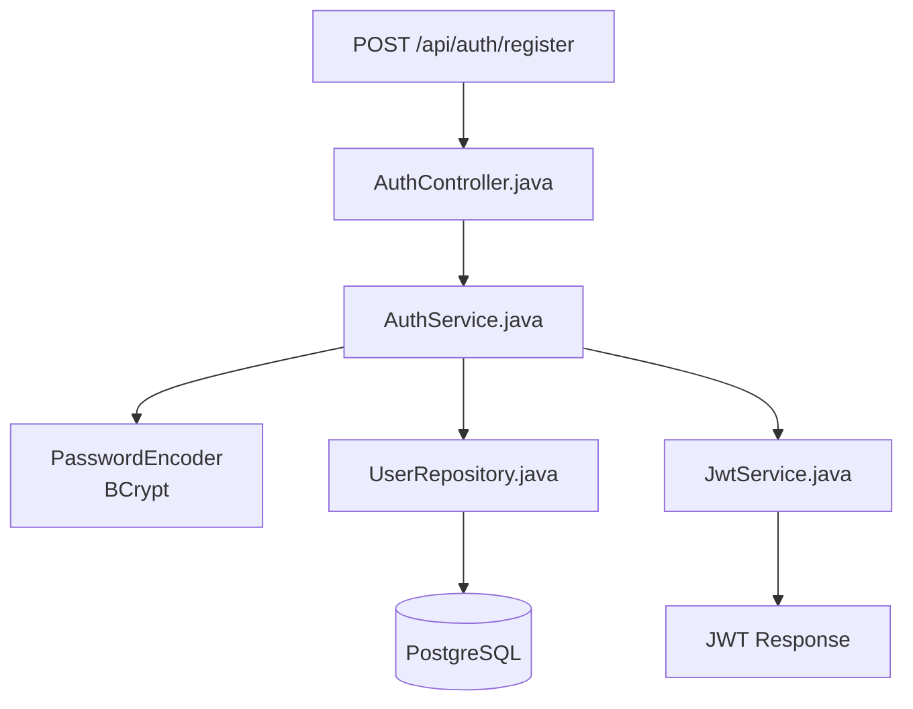

### What Happens

1. Request reaches AuthController.
2. AuthService encodes password.
3. User saved to database.
4. JWT generated.
5. JWT returned to client.

---

## User Login

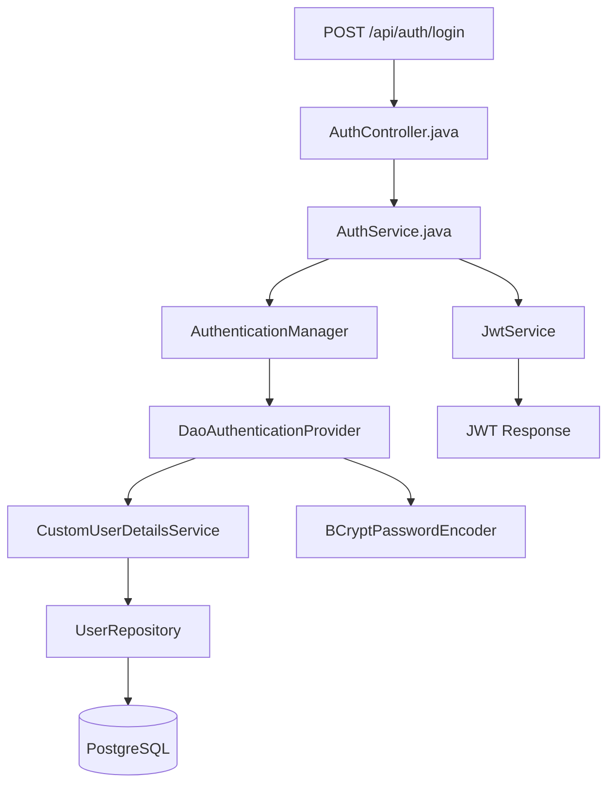

### What Happens

1. User submits credentials.
2. AuthenticationManager validates them.
3. User loaded from DB.
4. Password checked using BCrypt.
5. JWT generated.
6. JWT returned.

---

# JWT Protected Request Flow

Example:

```http
PUT /api/events/1
Authorization: Bearer <token>
```

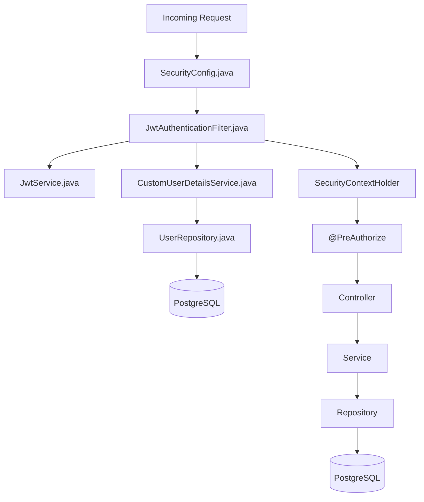

### What Happens

1. Security filter intercepts request.
2. JWT extracted.
3. JWT validated.
4. User loaded.
5. User stored in SecurityContext.
6. @PreAuthorize checks roles.
7. Controller executes.
8. Service executes.
9. Repository accesses database.

---

# Create Event Flow

Endpoint:

```http
POST /api/events
```

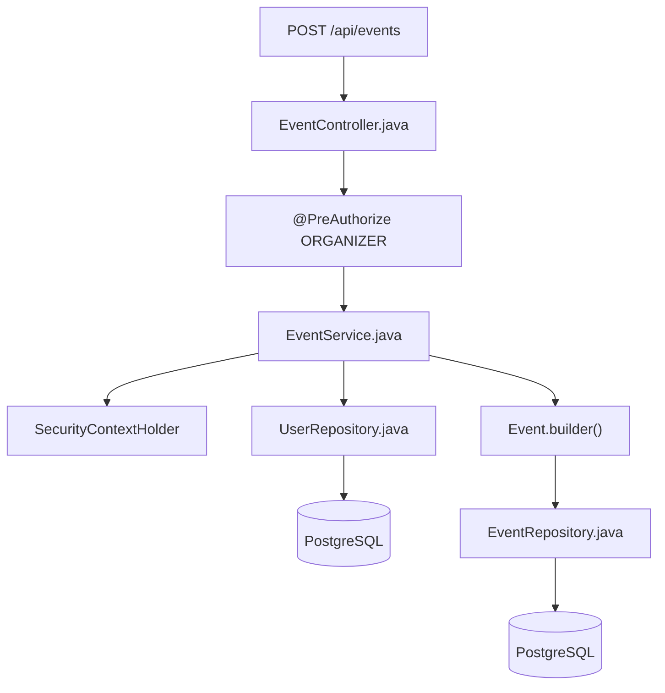

### What Happens

1. Organizer calls API.
2. Role validation occurs.
3. Logged-in organizer extracted.
4. Organizer fetched from DB.
5. Event entity created.
6. Event saved.

---

# Get Event By Id Flow

Endpoint:

```http
GET /api/events/{id}
```

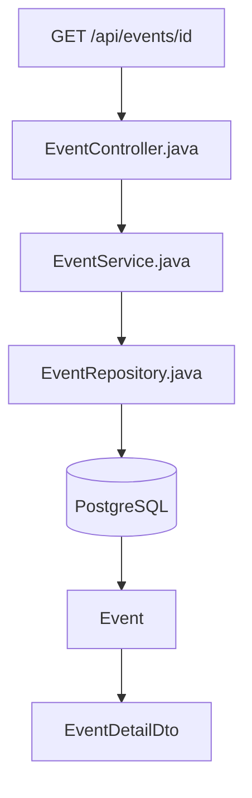

### What Happens

1. Event fetched.
2. Entity converted into DTO.
3. DTO returned.

---

# Update Event Flow

Endpoint:

```http
PUT /api/events/{id}
```

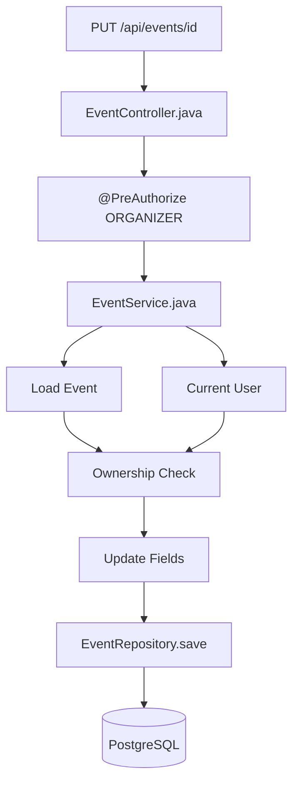

### What Happens

1. Event loaded.
2. Current user identified.
3. Ownership verified.
4. Event updated.
5. Changes saved.

---

# Delete Event Flow

Endpoint:

```http
DELETE /api/events/{id}
```

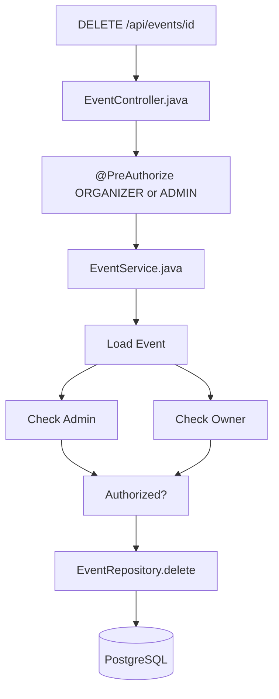

### What Happens

Deletion allowed if:

- User is ADMIN
- OR User owns the event

---

# Organizer Dashboard Flow

Endpoint:

```http
GET /api/organizer/events
```

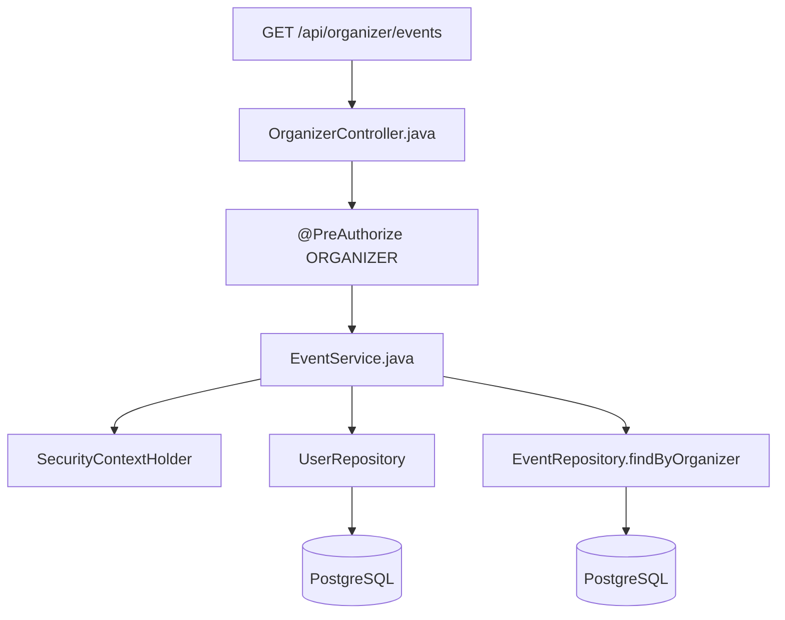

### What Happens

1. Organizer identified.
2. Organizer loaded.
3. Only organizer's events returned.

---

# Public Event Discovery Flow

Endpoint:

```http
GET /api/events
```

Example:

```http
/api/events?page=0&size=10

/api/events?title=music

/api/events?location=kolkata

/api/events?date=2026-12-01
```

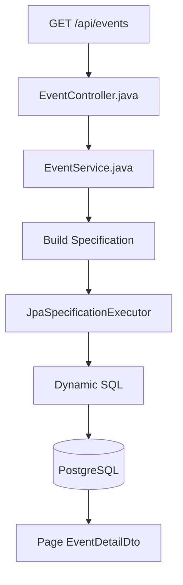

### What Happens

1. Optional filters received.
2. Specification built dynamically.
3. Dynamic query generated.
4. Results paginated.
5. DTOs returned.

---

# Current Layered Architecture

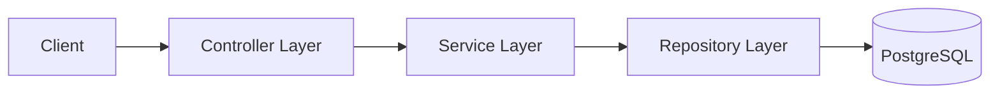

---

# Security Architecture Summary

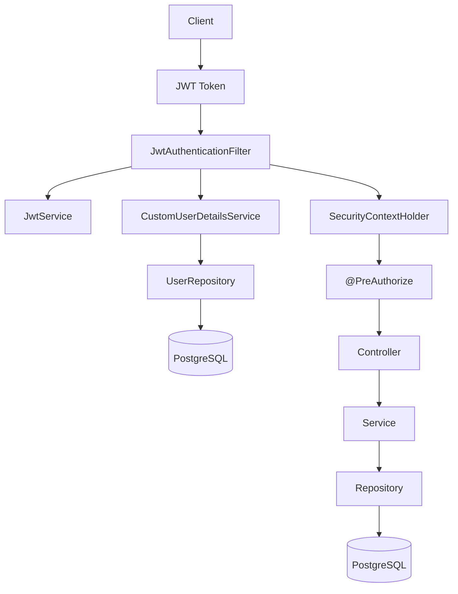

---

# Current Features

- JWT Authentication
- Role-Based Authorization
- Ownership-Based Authorization
- Event Creation
- Event Retrieval
- Event Update
- Event Deletion
- Organizer Dashboard
- Public Event Listing
- Pagination
- Search
- Filtering
- DTO Mapping
- Spring Security
- JPA Specifications