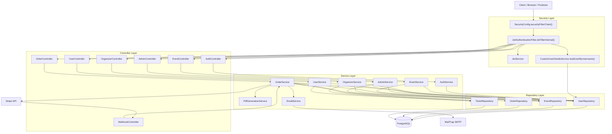

```mermaid
flowchart TD

Client["Client / Browser / Postman"]

subgraph Security Layer
    SC["SecurityConfig.securityFilterChain()"]
    JWTF["JwtAuthenticationFilter.doFilterInternal()"]
    JWTS["JwtService"]
    CUDS["CustomUserDetailsService.loadUserByUsername()"]
end

subgraph Controller Layer
    AUTHC["AuthController"]
    EVENTC["EventController"]
    ORDERC["OrderController"]
    ORGC["OrganizerController"]
    USERC["UserController"]
    ADMINC["AdminController"]
    WEBHOOKC["WebhookController"]
end

subgraph Service Layer
    AUTHS["AuthService"]
    EVENTS["EventService"]
    ORDERS["OrderService"]
    ORGS["OrganizerService"]
    USERS["UserService"]
    ADMINS["AdminService"]
    PDFS["PdfGenerationService"]
    EMAILS["EmailService"]
end

subgraph Repository Layer
    USERREPO["UserRepository"]
    EVENTREPO["EventRepository"]
    ORDERREPO["OrderRepository"]
    TICKETREPO["TicketRepository"]
end

Database[(PostgreSQL)]

Stripe["Stripe API"]
Mail["MailTrap SMTP"]

Client --> SC
SC --> JWTF

JWTF --> JWTS
JWTF --> CUDS

CUDS --> USERREPO

JWTF --> AUTHC
JWTF --> EVENTC
JWTF --> ORDERC
JWTF --> ORGC
JWTF --> USERC
JWTF --> ADMINC

AUTHC --> AUTHS
EVENTC --> EVENTS
ORDERC --> ORDERS
ORGC --> ORGS
USERC --> USERS
ADMINC --> ADMINS
WEBHOOKC --> ORDERS

AUTHS --> USERREPO

EVENTS --> USERREPO
EVENTS --> EVENTREPO

ORDERS --> USERREPO
ORDERS --> EVENTREPO
ORDERS --> ORDERREPO
ORDERS --> TICKETREPO

ORGS --> USERREPO
ORGS --> EVENTREPO
ORGS --> TICKETREPO

USERS --> USERREPO
USERS --> TICKETREPO

ADMINS --> USERREPO
ADMINS --> EVENTREPO

USERREPO --> Database
EVENTREPO --> Database
ORDERREPO --> Database
TICKETREPO --> Database

ORDERS --> Stripe

ORDERS --> PDFS
ORDERS --> EMAILS

EMAILS --> Mail

Stripe --> WEBHOOKC
```