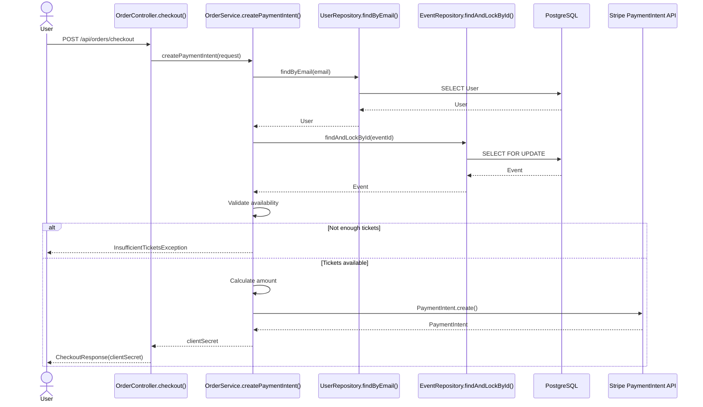

```mermaid
sequenceDiagram

actor User

participant OC as OrderController.checkout()
participant OS as OrderService.createPaymentIntent()
participant UR as UserRepository.findByEmail()
participant ER as EventRepository.findAndLockById()
participant DB as PostgreSQL
participant Stripe as Stripe PaymentIntent API

User->>OC: POST /api/orders/checkout

OC->>OS: createPaymentIntent(request)

OS->>UR: findByEmail(email)
UR->>DB: SELECT User
DB-->>UR: User
UR-->>OS: User

OS->>ER: findAndLockById(eventId)
ER->>DB: SELECT FOR UPDATE
DB-->>ER: Event
ER-->>OS: Event

OS->>OS: Validate availability

alt Not enough tickets
    OS-->>User: InsufficientTicketsException
else Tickets available
    OS->>OS: Calculate amount
    OS->>Stripe: PaymentIntent.create()
    Stripe-->>OS: PaymentIntent
    OS-->>OC: clientSecret
    OC-->>User: CheckoutResponse(clientSecret)
end
```