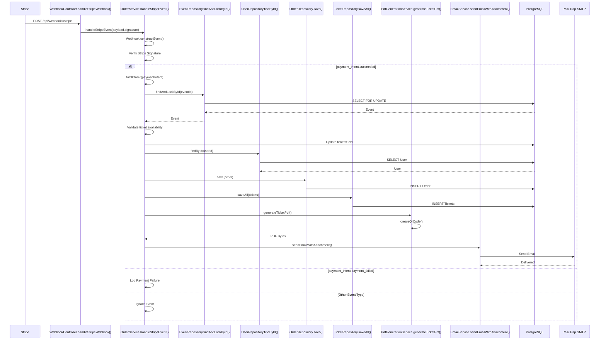

```mermaid
sequenceDiagram

participant Stripe

participant WC as WebhookController.handleStripeWebhook()

participant OS as OrderService.handleStripeEvent()

participant ER as EventRepository.findAndLockById()

participant UR as UserRepository.findById()

participant OR as OrderRepository.save()

participant TR as TicketRepository.saveAll()

participant PDF as PdfGenerationService.generateTicketPdf()

participant EMAIL as EmailService.sendEmailWithAttachment()

participant DB as PostgreSQL

participant SMTP as MailTrap SMTP

Stripe->>WC: POST /api/webhooks/stripe

WC->>OS: handleStripeEvent(payload,signature)

OS->>OS: Webhook.constructEvent()

OS->>OS: Verify Stripe Signature

alt payment_intent.succeeded

    OS->>OS: fulfillOrder(paymentIntent)

    OS->>ER: findAndLockById(eventId)
    ER->>DB: SELECT FOR UPDATE
    DB-->>ER: Event
    ER-->>OS: Event

    OS->>OS: Validate ticket availability

    OS->>DB: Update ticketsSold

    OS->>UR: findById(userId)
    UR->>DB: SELECT User
    DB-->>UR: User

    OS->>OR: save(order)
    OR->>DB: INSERT Order

    OS->>TR: saveAll(tickets)
    TR->>DB: INSERT Tickets

    OS->>PDF: generateTicketPdf()

    PDF->>PDF: createQrCode()

    PDF-->>OS: PDF Bytes

    OS->>EMAIL: sendEmailWithAttachment()

    EMAIL->>SMTP: Send Email

    SMTP-->>EMAIL: Delivered

else payment_intent.payment_failed

    OS->>OS: Log Payment Failure

else Other Event Type

    OS->>OS: Ignore Event

end
```