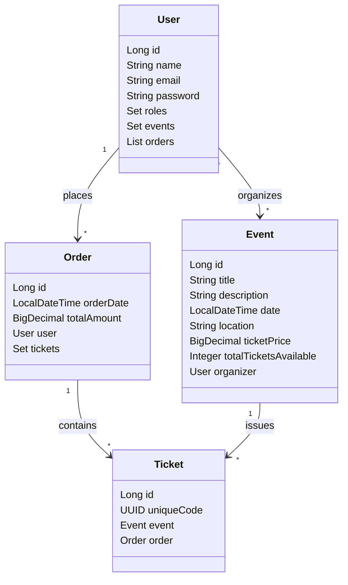

```mermaid
classDiagram

class User {
    Long id
    String name
    String email
    String password
    Set<Role> roles
    Set<Event> events
    List<Order> orders
}

class Event {
    Long id
    String title
    String description
    LocalDateTime date
    String location
    BigDecimal ticketPrice
    Integer totalTicketsAvailable
    User organizer
}

class Order {
    Long id
    LocalDateTime orderDate
    BigDecimal totalAmount
    User user
    Set<Ticket> tickets
}

class Ticket {
    Long id
    UUID uniqueCode
    Event event
    Order order
}

User "1" --> "*" Event : organizes
User "1" --> "*" Order : places
Order "1" --> "*" Ticket : contains
Event "1" --> "*" Ticket : issues
```